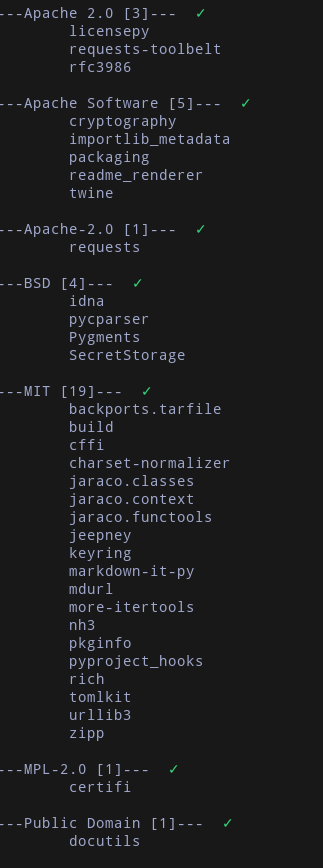
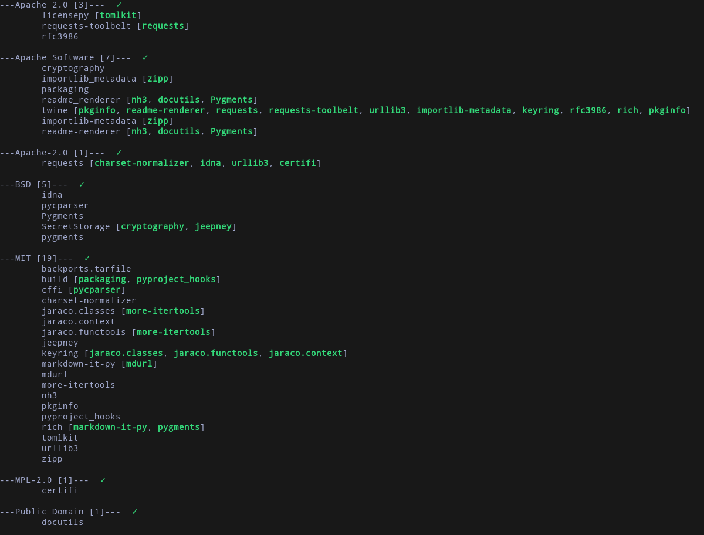
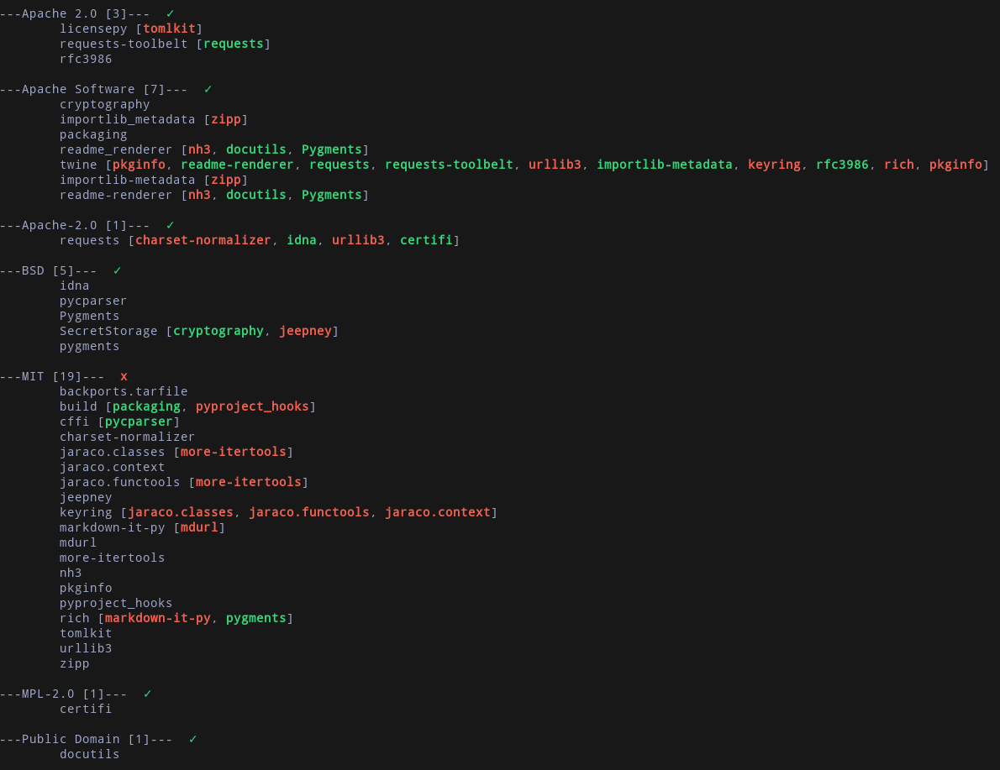
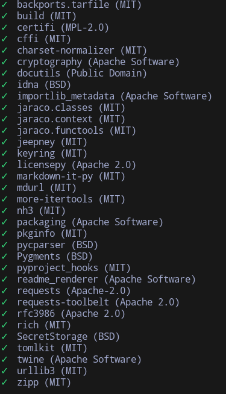
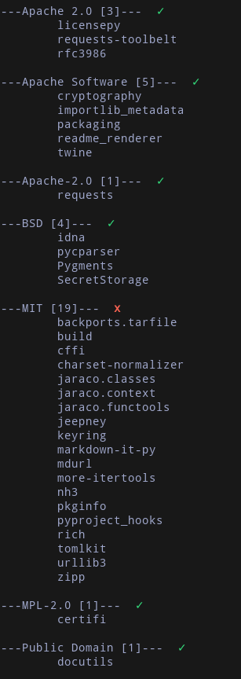
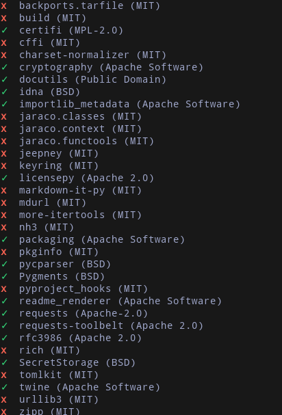

# licensepy: Python License Check Module.

***licensepy*** is a Python dependency license check library with recursive dependency handling for pip (and conda in the future). This package has recusive dependency checks that are not offered by many existing license check libraries. By default, the output will gorup packages by their licenses.



Command line arguments can be used to recusively check all the dependencies of the project (-r, --recursive), group output by pacakges in alphabetical order (--by-package), silence all outputs (-s, --silent), or only print fails (-f, --print-fails).

Configure the tool with a _pyproject.toml_ file at the root directory of the project with a list of licenses to avoid. If any one the dependencies of the project use these flagged licenses, **licensepy** will exit with code 1. Otherwise, it will exit with code 0.

## Installing

Use pip to install **licensepy** in your project.

```bash
pip3 install licensepy

```

## Command Line Arguments

1. -r, --recursive: Recursively find all the dependencies of the project and their licences.
   
   - Recusive dependencies will have the color red if they have licenses that have been flagged to avoid and green otherwise.
     
1. -by-package: Groupt output by packages in alphabetial order.
   
1. -s, silent: Silence all outputs.
1. -f, print-fails: Only print the packages whose licenses are flagged to be avoided.

## Configuration

Licenses can be flagged to avoid in a pyproject.toml files saved in the root of the project directory. Licenses should be stored in a list.

```toml
# In the pyproject.toml file

[licensepy]
avoid = ["MIT"]
```

This is the output when the above configuration is used for:

1.  ```bash
    licensepy
    ```

    

1.  ```bash
    licensepy --by-package
    ```

    
